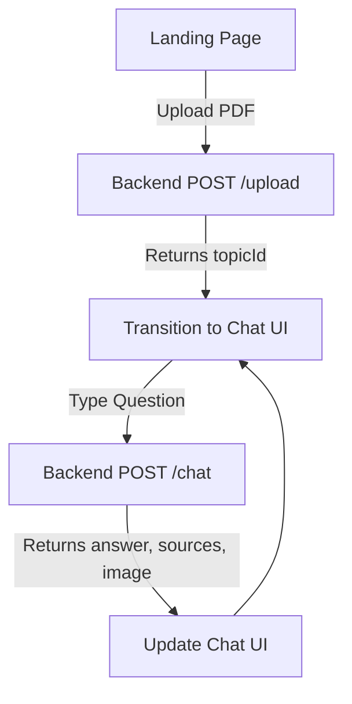

## 1. Product Overview
The AI Tutor is an interactive educational chatbot interface designed to help users learn from uploaded PDF documents.
It provides a professional, animated, and highly polished user experience that connects directly to an existing RAG (Retrieval-Augmented Generation) backend.

## 2. Core Features

### 2.1 User Roles
| Role | Registration Method | Core Permissions |
|------|---------------------|------------------|
| Normal User | No login required | Upload PDFs, chat with AI Tutor, view extracted sources and relevant images |

### 2.2 Feature Module
1. **Landing/Upload Page**: Hero section, animated introduction, drag-and-drop PDF upload zone.
2. **Chat Interface Page**: Real-time chat interface, message history, source display, and image visualizer.

### 2.3 Page Details
| Page Name | Module Name | Feature description |
|-----------|-------------|---------------------|
| Landing Page | Hero section | Animated title, sub-headline, and an engaging dropzone for document upload. |
| Chat Page | Chat view | Message list showing user and AI messages. The AI messages will display text, cited sources, and relevant retrieved images. |
| Chat Page | Input section | Text input field with an animated submit button, disabled during loading states. |

## 3. Core Process
1. User visits the application and sees the landing screen.
2. User uploads a PDF document (calls `POST /upload`).
3. On successful upload, a `topicId` is returned and stored in the application state.
4. The UI transitions smoothly to the Chat Interface.
5. User types a question and submits it (calls `POST /chat`).
6. The AI Tutor responds with an answer, relevant text chunks (sources), and visual aids (images).

## 4. User Interface Design
### 4.1 Design Style
- **Primary Colors**: Deep Navy (`#0A192F`) to vibrant Indigo (`#4F46E5`) for a professional, trustworthy feel.
- **Secondary Colors**: Soft Slate (`#64748B`) for secondary text, glowing accents (`#38BDF8`) for animations.
- **Button style**: Rounded corners (e.g., `rounded-xl`), subtle glassmorphism, and smooth hover/active scale animations.
- **Font and sizes**: Clean sans-serif fonts (e.g., Inter or Plus Jakarta Sans) for high readability. Large, bold headers and legible body text.
- **Layout style**: Centered, distraction-free container. The chat uses a modern bubble layout with an attached side-panel or inline cards for sources/images.
- **Motion/Animation**: Framer Motion for page transitions, message staggered fade-ins, and animated loading indicators (e.g., pulsing dots or a spinning gradient border).

### 4.2 Page Design Overview
| Page Name | Module Name | UI Elements |
|-----------|-------------|-------------|
| Landing Page | Hero section | Large animated typography, gradient text, glowing dropzone box. |
| Chat Page | Message List | Distinct styles for User (solid accent color) vs AI (glass/card style). Inline display of source excerpts and images. |

### 4.3 Responsiveness
Desktop-first design with smooth fluid typography. Mobile-adaptive layouts where side-by-side elements stack vertically on smaller screens. Touch-optimized buttons and inputs.
