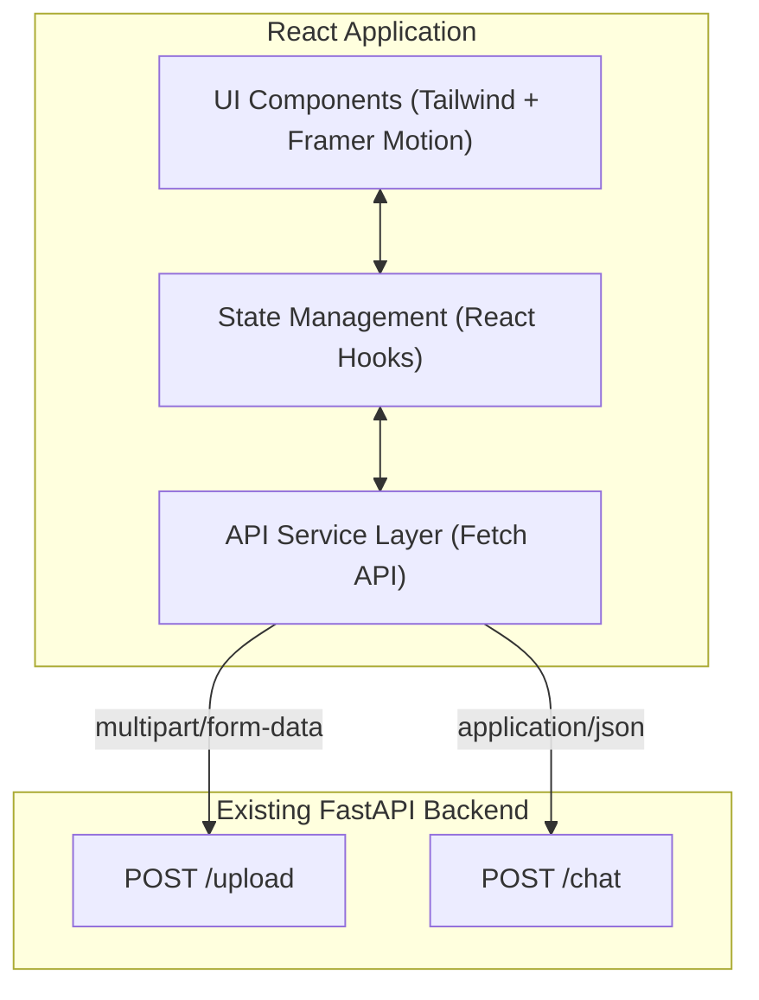
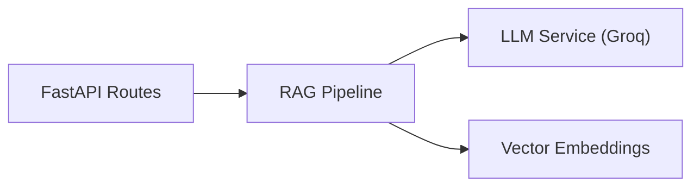

## 1. Architecture Design



## 2. Technology Description
- **Frontend**: React@18 + TailwindCSS@3 + Vite
- **Animation**: Framer Motion (for page transitions, loading states, and message staggered animations)
- **Icons**: Lucide React
- **HTTP Client**: Native `fetch` API

## 3. Route Definitions
Since this is a simple two-state flow, we can manage it via conditional rendering or simple React Router:
| Route | Purpose |
|-------|---------|
| `/` | Landing page / PDF Upload |
| `/chat` | Chat interface (accessible only if `topicId` exists in state/session) |

## 4. API Definitions (Connecting to existing backend)

### 4.1 Upload PDF
- **Endpoint**: `POST http://localhost:8000/upload`
- **Request**: `multipart/form-data` with `file: File`
- **Response**:
```typescript
interface UploadResponse {
  topicId: string;
}
```

### 4.2 Chat
- **Endpoint**: `POST http://localhost:8000/chat`
- **Request**:
```typescript
interface ChatRequest {
  topicId: string;
  question: string;
}
```
- **Response**:
```typescript
interface ChatResponse {
  answer: string;
  sources: string[];
  image: string | null;
}
```

## 5. Server Architecture Diagram
*(Backend already exists - simple FastAPI wrapping RAG logic)*


## 6. Data Model
No complex frontend data models are required beyond standard React state to hold the `topicId` and `history`.

```typescript
interface Message {
  id: string;
  role: 'user' | 'assistant';
  content: string;
  sources?: string[];
  image?: string | null;
}
```
